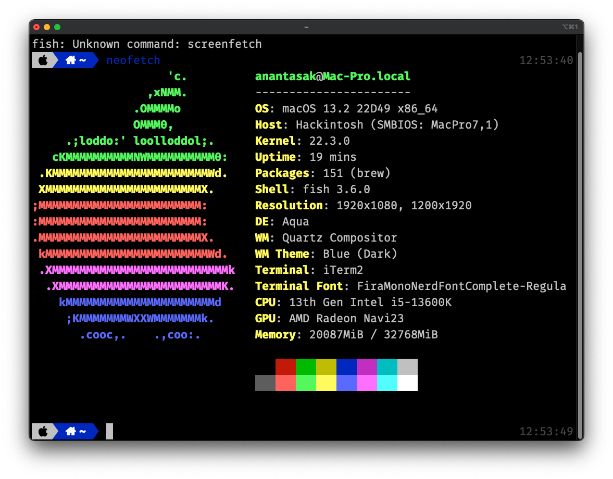
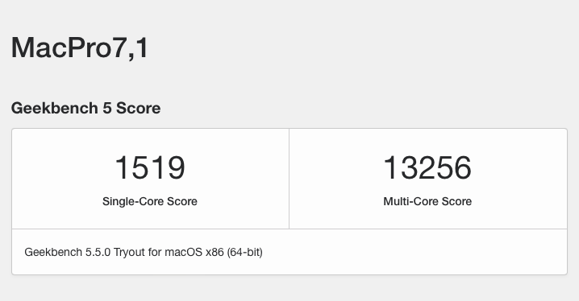

OC: 0.8.8

MB: Asrock H670 PG Riptide

CPU: Core i5 13600K

RAM: Hikvision 16GB X2 2666 OC to 3467

VGA: Gigabyte RX6650XT Spoof ID

OS: Ventura 13.2

WIFI: GlinkStar BCM94360CD

---

## Know Issue

- Random panic
- Android Emulator Black Screen on x86_x64, on X86 Working fine

## Base Efi From Asrock Z690SL

https://www.tonymacx86.com/threads/asrock-z690-steel-legend-13900kf-12900k-6600xt.317456/